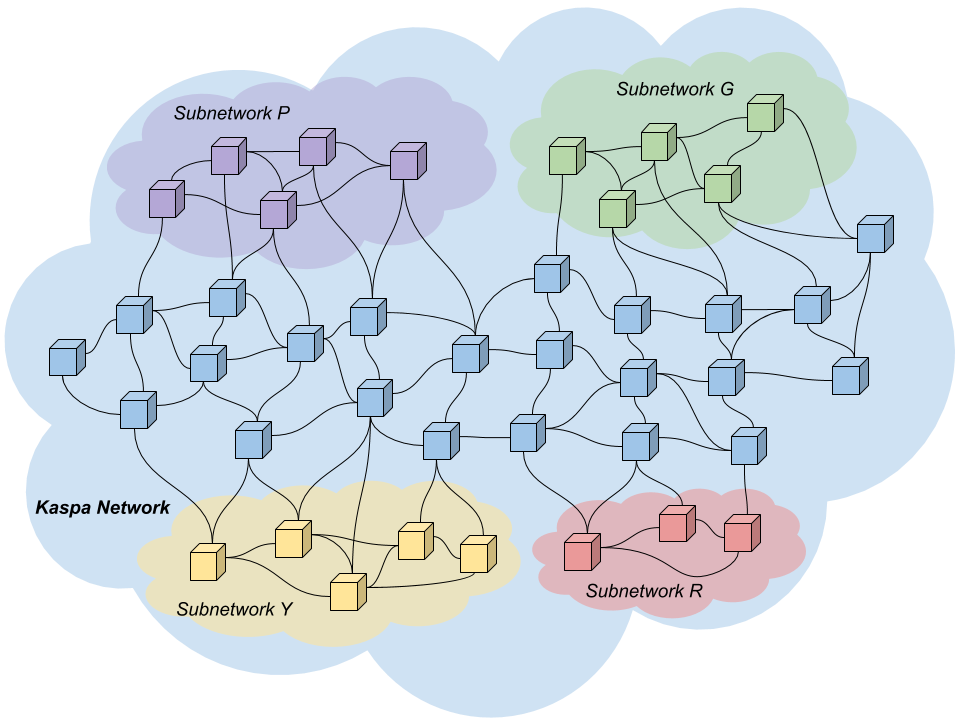
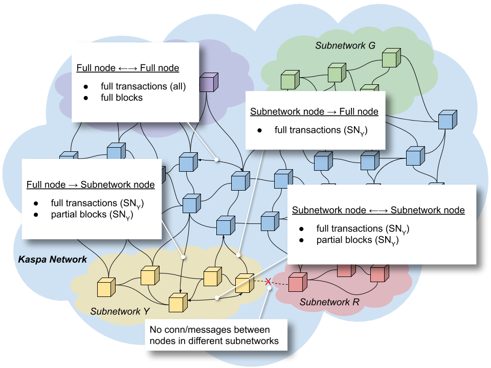

# Subnetworks

## Introduction to Kaspa Subnetworks

Subnetworks is a mechanism in Kaspa's consensus layer that allows nodes with a common interest to form nested networks with their own rules within the greater Kaspa network. The beautiful thing about subnetworks in Kaspa is that they allow parties to run custom logic and smart contracts, yet, they do not force all nodes in the Kaspa network to spend network and computational resources on verifying subnetwork-specific logic.

To enable subnetworks, Kaspa introduces three new special fields inside the transaction:

* `subnetwork` is the subnetwork ID. You may think of it as a transaction type.
* `payload` is a field to store arbitrary data, and code relevant to the subnetwork.
* `payloadHash` is the hash of the arbitrary data in the field `payload`.


While the `payload` field is part of the Kaspa transaction hash, the `payloadHash` field is part of the transaction hash. This allows nodes uninterested in certain subnetworks to ignore the payload of transactions in those subnetworks.


## Kaspa Reserved Subnetworks

There are three predefined subnetworks in Kaspa:

* `subnetwork 0` - Kaspa native subnetwork
* `subnetwork 1` - Kaspa coinbase subnetwork
* `subnetwork 2` - Kaspa registry subnetwork

Q: Are there reserved subnetworks, e.g. for stable Kaspa and WoT networks?


The subnetwork is a 20 byte long hash, so `subnetwork 0` is actually twenty bytes of Zeroes.


### Kaspa Native Subnetwork

The Kaspa native subnetwork is used to send all native Kaspa transactions. Native Kaspa transactions do not use the payload field, and this field must be empty.

### Kaspa Coinbase Subnetwork

The Kaspa coinbase subnetwork is used for coinbase transactions: these are transactions that pay block rewards to miners. Coinbase transactions include minting of new Kaspa when discovering new blocks and transaction fees - let's call them block rewards. Rather than paying block rewards for a block by including a coinbase transaction in the same block, In Kaspa the block rewards for a given block are paid to the block's creating miner by later blocks. The reason for this, is that in Kaspa, at the time of creating a block, it is not known if some transactions in that block were also included in a parallel block, and which block comes first according to the PHANTOM ghostDAG consensus protocol. Thus, the exact sum of the transaction fees to be paid to the miner is unsettled yet. Therefore, instead of the traditional way where each block charges the fees of its included transactions, in Kaspa, the miner specifies the public address to pay transaction fees to, in the `payload` field in the block he creates. You may think of it as a "pay my block rewards here" message by a miner of a block, to later blocks pointing to it. In order for blocks to be valid, they must pay the required fees to the blocks they point to.

The advantage to miners is that, if they are honest and follow the protocol, they need not worry whether they are mining a block on the longest chain, or on a side chain. They need not worry about their block becoming orphaned, and as a consequence losing all block rewards. In Kaspa, miners just mine, there can be side chains and PHANTOM ghostDAG will at high probability accept all blocks. The worst thing that could happen is that the miner might not get fee for some transactions in his block, if the PHANTOM ghostDAG protocol decided that these transactions were already mined in an earlier block.

The advantage above is also beneficial to transacting users. Their transactions have a much lower chance of being included in orphaned blocks and therefore much lower chance to be discarded.


Coinbase transactions are not gossiped through the network. They only appear in blocks.


### Kaspa Registry Subnetwork

The Kaspa registry subnetwork is used to create new subnetworks. In order to create and announce a new subnetwork, one needs to makes a transaction on `subnetwork 2`; the resulting hash of this transaction is the new subnetwork ID. When creating the registration transaction, the `payload` field should include special instructions for the new subnetwork, such as gas limit per block.

In addition to the existing block size limit, every subnetwork has a gas limit: an upper limit on the sum of the claimed gas of all of that subnetwork's transactions within a block. In other words: the subnetwork's gas limit is an instruction by the creator of the subnetwork to all miners, not to include transactions \(of their subnetwork\) with a gas sum higher than the subnetwork's gas limit within any block.

This agreement is in place to limit miners from including transactions and charging their corresponding fees in their blocks, that the subnetworks will not be willing nor capable to handle. Miners want to insert as many transactions to each block as possible, in order to get more fees. Subnetworks on the other hand don't want blocks to include too many transactions because they cannot necessarily process more than a certain amount of transactions per block, because each of them involves a cetrain gas expenditure as a result of running the code included in the `payload` field. Therefore the subnetworks instruct the miners to limit transactions of their subnetwork in any block to the gas limit. If miners break this agreement, they will be banned from the network.

## Subnetwork Usage

### Definitions

#### Full-nodes

Full-nodes are nodes that listen to all transactions in the Kaspa network, including all subnetworks.

#### Subnetwork-nodes

Subnetwork-nodes are nodes interested in transactions specific to a certain subnetwork. They listen to the three predefined subnetworks 0, 1 and 2 and to the subnetwork they are interested in. Subnetwork-nodes cannot mine, because they do not have full blocks.


The Kaspa protocol requires that all nodes \(full or subnetwork\) in the P2P network transmit and validate all transactions with the predefined 0, 1 and 2 subnetworks.


#### Partial Transaction

A partial transaction is a transaction with the `payload` field zeroed.

#### Partial Block

A partial block for a given subnetwork is a block that contains regular \(full\) transactions for the given subnetwork, and partial transactions for any subnetwork other than the given subnetwork.

### Joining the Network

When a node joins the Kaspa network, it tells its peers if it is a full-node or a subnetwork-node. Full-nodes listens to all transactions in all subnetworks. Subnetwork-nodes specify what subnetworks they are on, and by that, what transactions they want to subscribe to. For instance, listen to 0, 1, 2 and Y.

### Who Can Connect to Whom?

Full-nodes initiate connections only to full nodes, but accept connections from any node.

Subnetwork-nodes initiate connections to full-nodes and to other nodes in the same subnetwork, and do not accept connections from nodes not in the same subnetwork.

### Transaction and Block Messages between Nodes

Full-nodes exchange all transactions and full blocks with other full-nodes.

Full-nodes send subnetwork-nodes only transactions in their subnetwork and partial blocks tailored for their subnetwork \(containing full data for transactions in their subnetwork and partial transactions for transactions not in their subnetwork\).

Subnetwork-nodes send full-nodes transactions from the subnetwork.

Subnetwork-nods exchange transactions and partial blocks with other subnetwork-nodes in the same subnetwork.

## Conclusion

Subnetworks allow peers to group into application specific clusters. Peers within those clusters exchange transactions only relevant to their application and blocks stripped of data that is redundant to them. There is an isolation between subnetworks and all the logic and data generated in one subnetwork, does not bloat other subnetworks. It saves network traffic, and computational resources.

