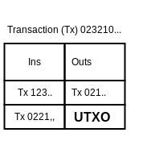
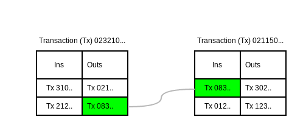

# Kaspa Transactions

Kaspa transactions are structurally identical to Bitcoin transactions, although they have some different characteristics \(such as faster confirmation time\) by virtue of its being on a different network.

As an overview, you should keep in mind the following about Kaspa Transactions:

* They are shorthand expressed as Tx
* They contain a ledger of 'Ins' & 'Outs' \(think in terms of 'Income' & 'Expenses'.
* .....

### UTXO: Unspent Transaction Output

'**Unspent Output**' means any Tx 'In' without a corresponding 'Out' -  representing available coin balance in the system.

The following diagram shows how a Tx is made up of ins & outs, which are themselves references to other Txs.  



###  Tx Lifecycle & Flow in Kaspa

Transactions are the core flow of the ....



### Kaspa's Tx Implementation in Golang

The following is Kaspa's Tx structure:



```text
type MsgTx struct {
	Version      int32
	TxIn         []*TxIn
	TxOut        []*TxOut
	LockTime     uint64
	SubnetworkID subnetworkid.SubnetworkID
	Gas          uint64
	PayloadHash  *daghash.Hash
	Payload      []byte
}
```



The following function MsgTx returns the underlying wire.MsgTx for the transaction.

```text
func (t *Tx) MsgTx() *wire.MsgTx {
	// Return the cached transaction.
	return t.msgTx
}
```

Tx makes it easier to interact with underlying MsgTx data

```text
type Tx struct {
	msgTx   *wire.MsgTx   // Underlying MsgTx
	txHash  *daghash.Hash // Cached transaction hash
	txID    *daghash.TxID // Cached transaction ID
	txIndex int           // Position within a block or TxIndexUnknown
}
```


