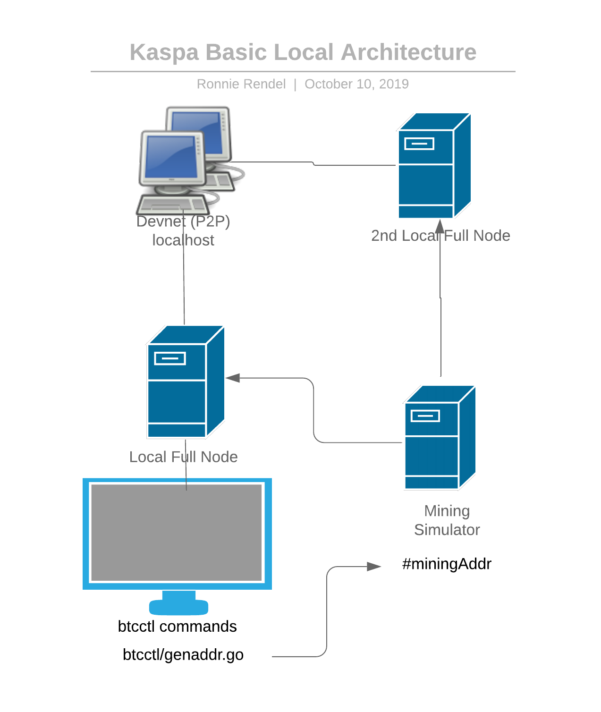

# Overview of Kaspa Full Node Operations

I assume you're here because you finally got your hands on our Kaspa code repo and you just can't wait to see what it can do.  We feel ya.  

So, here's the first thing you probably want to do - launch a local Kaspa node and start playing around with some transactions \('tx' from now on, ok?\)

## Preliminaries:

* Kaspa, like Bitcoin \(and unlike Ethereum\) uses UTXO sets instead of Accounts to calculate balance, with implications to how transactions are submitted, verified, determine tx fee, etc.
* Like Ethereum, Kaspa uses 'gas' to compensate for computational costs, however Kaspa's gas fee is preset, unlike Ethereum where you set a gas limit but the actual gas fee is determined in runtime.
* For an overview of the Kaspa protocol & some basics about the Kaspa network, please see [this article](quick-starting-a-kaspa-local-node.md).
* The current codebase is configured to work with DevNet, working with TestNet \(and eventually MainNet\) may require some changes.

## Running a local Kaspa node:

For instructions on building & running your local Kaspa node please see [this article](quick-starting-a-kaspa-local-node.md).

Fore general information about Kaspa transactions please [see this guide](introducing-kaspa-transactions.md).

Once you have a couple of nodes running and you can successfully connect via btcctl commands you should be ready to pick up the tutorial from here.


Keep in mind you need at least 2 running nodes to have any meaningful transactions, as well as simulating mining to create blocks.


## Other network configuration \(local dev\):

For local development, you can use the following default credentials:

```text
--devnet
--connect=localhost:18333
--listen=localhost:18533
--debuglevel=debug
--rpcuser=user
--rpcpass=pass
--rpclisten=localhost:18534
--notls
--addrindex
-b
/tmp/btcd3
--miningaddr
dagtest:qz9wgwh7kfv9zuxvwst55a7sesjvjpjvsst7ehwzh0
```


Note that for local development you're setting the network to --_devnet_.  This setting affects how your network's Genesis block will be created.



For --_miningaddr_ you can use any address created using the _genaddr_ command in the _cmd_ package.


## Basic Kaspa network architecture

When you launch a local full node you can use it to generate a new Kaspa address.  Use this address as the minindAddr for Kaspa's Mining Simulator, writing a new block ever 1 second and simulating all the other functions performed by Kaspa miners.

We recommend also launching a second node, allowing you to connect to a multi-node network which is considerably more phone then going at it alone :\) 



* tx-gen : receives all the blocks, private key, knows how to generate address,

  **-- uses JSON-RPC requests**

* mining simulator

  **--  address that if you do mining you use this address**

* main config take private key and create address tx-gen creates tx and store locally connect to server: connect to a node on DevNet3 user/pass for rpc connect to node transmit user/pass address !success notify blocks: bring me all the blocks,... send via websocket 'yes' -- callbacks for different notification send to channel \(another place reads and handles this channel\) receive block header only for requested tx, other then explicit block address which can include complete tx detail 'Spawn' - Kaspa's Go routine, better handles underlying 'panic' preventing a crash. Use Spawn instead of Go. -- insert tx-loop, if any issue force 'panic' -- create channel \(receives events, waits for you to receive something for channel\) -- runs until exit

tx-loop: \[

* tx-gen assumes it's the only one spending money
* simulates spending by periodically sending ,omey to a secpndary address - also defined in its config
* only ttransactions that fit certain filter included...
* every subnet has its own 'gas' - every tx costs some 'gas' and there is a block limit that canot be exceeded,

  --  subnwt is a black box as far as the network, but you don't want to amass too much on the sub-network servers

  --  you can add arbotrary data to a tx through the use of the sub-network object

  --  others can send to your sub-network and you can define the 'gas' \(!!!\)

sub-networks: -- tx includes 'payload': way to send data with a tx without, includes subnet-id, gas, date. -- like op-return for btc \(used for tokenization ontop of bitcoin\) -- publishes the state of the 'address' and publish the code - running it, costing 'gas', etc. -- miners don't absorb the 'cost' of computation for a sub-network \(just code referencencing subnet-vm addresses\) -- tricky to figure out the optimal 'gas' amount for computational needs and 'rules' on the vm-subnet.

### -- bad 'gas' computation should lead to tx failure - cost on subnet forces coputational logic to developer\)

wallet utxo set

* local utxco set for local tx
* searchalltransactions... for address
* get tx from genesis until I turned on
* all approved tx have their output added to local utxo set
* remove the inputs of above tx from the utxo set
* dont care about confirmed or unconfirmed, either way considered 'spent' txo...
* open channel and submit tx's

  --  see all tx associated wioth your address

  **--  acts like a buffer to utxo set**

Update-subnetwork

* some tx are in a special subnetwork \(subnetwork-id-registry\), these tx are used to form subnetwork
* it is stored as a tx and used to form subnetworks
* their own payload defines the gas fee for the subnetworks created by this tx
* once you know which subnetworks exist and I can start using them to submit transactons.

Dust: tx whose value is less then the minimum fee, these tx are not accepted into mempool

end tx-loop \]

