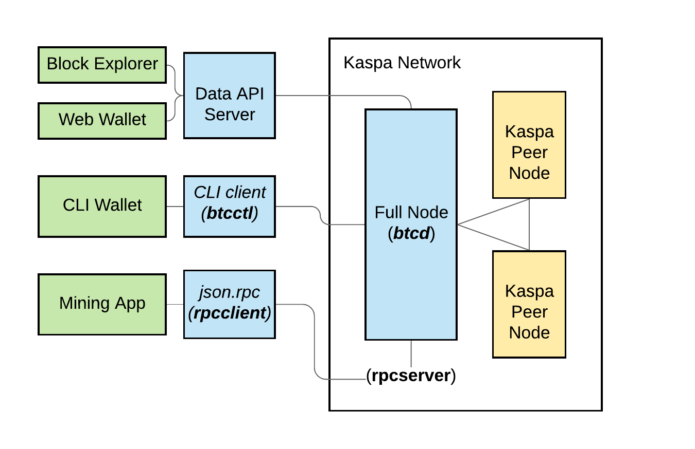

# Components

## Kaspa Components

The Kaspa code repository includes the following components:

1. **Full Node \(btcd\)**: The code for building & running a Kaspa full node.
2. **Node CLI Client \(btcctl\)**: CLI commands for interacting with your full node.
3. **JSON-RPC API \(rpcclient\)**: RPC tool for using the full node.
4. **API Server \(apiserver\)**: Optimized for running a client application such as a block explorer or wallet.

### Full Node

The full nodes form the peer-to-peer Kaspa network and act as its connection point.  You will need to [run a full node ](running-a-node/)in order to begin working with the network.

### Node CLI Client

Set of bash commands for interacting with the full node.  After you have a full node running, use these instructions for [setting up and using the CLI Client](running-a-node/interact-with-a-node/node-cli-interface.md).

### JSON-RPC API

JSON-RPC calls for interacting with the node, used by mining applications, verifying, and publishing transactions.  Use these instructions for [using the JSON-RPC API](running-a-node/interact-with-a-node/node-json-rpc-api.md).

### API Server

If you want to develop applications on the Kaspa network like wallets or block explorers you will need to run an API Server connected to your Full Node.   

An alternative option, although less 'trust-less', is to connect to a public API server.  Use these[ instructions to launch your own API Server](api-server/) and connect to your full node.

### Next Steps

The remaining pages in this Getting Started section will walk you through building and launching your own node, some basic commands, and successfully generating network data.

For detailed description of available API methods, [please see this documentation section](../api-reference/code-ref/apiserver.md).

For more detailed information on the Kaspa BlockDAG [please see this knowledge base](../about-kaspa/kaspa-overview/).

