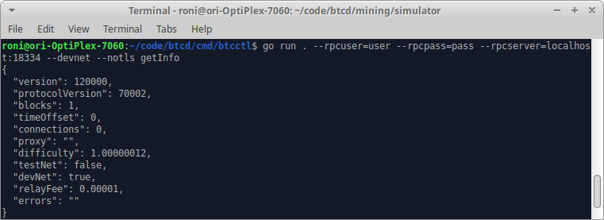

# CLI Commands

The Kaspa repository includes a package titled _btcctl_ you can use this tool for managing & utilizing your node using BASH commands 

### Running _btcctl_ commands

Once you have a full node running, you can use bash commands available inside the _**btcd/cmd/btcctl**_ ****directory to interact with your node and the network.  

These commands are processed by the node's _**rpcserver**_ component, just like _**rpcclient**_ requests.

1. Make sure you [have a running node](../) and connected to a Kaspa network.
2. Run the _**btcctl**_ client with the following network credentials:

```bash
go run . --rpcuser=user --rpcpass=pass --rpcserver=localhost:18334 --devnet --notls getInfo
```

### Example successful command & reply



### Note the following structure for CLI commands:

The following configuration options are required to define the node address, user, & settings to use with the **btcctl** Go command:

```text
--rpcuser=user 
--rpcpass=pass 
--rpcserver=localhost:18334 
--devnet 
--notls
```

The following is a complete list of available configuration options and their description:

```go
type config struct {
	ShowVersion   bool   `short:"V" long:"version" description:"Display version information and exit"`
	ListCommands  bool   `short:"l" long:"listcommands" description:"List all of the supported commands and exit"`
	ConfigFile    string `short:"C" long:"configfile" description:"Path to configuration file"`
	RPCUser       string `short:"u" long:"rpcuser" description:"RPC username"`
	RPCPassword   string `short:"P" long:"rpcpass" default-mask:"-" description:"RPC password"`
	RPCServer     string `short:"s" long:"rpcserver" description:"RPC server to connect to"`
	RPCCert       string `short:"c" long:"rpccert" description:"RPC server certificate chain for validation"`
	NoTLS         bool   `long:"notls" description:"Disable TLS"`
	Proxy         string `long:"proxy" description:"Connect via SOCKS5 proxy (eg. 127.0.0.1:9050)"`
	ProxyUser     string `long:"proxyuser" description:"Username for proxy server"`
	ProxyPass     string `long:"proxypass" default-mask:"-" description:"Password for proxy server"`
	TestNet3      bool   `long:"testnet" description:"Connect to testnet"`
	SimNet        bool   `long:"simnet" description:"Connect to the simulation test network"`
	DevNet        bool   `long:"devnet" description:"Connect to the development test network"`
	TLSSkipVerify bool   `long:"skipverify" description:"Do not verify tls certificates (not recommended!)"`
}
```

### List of available CLI commands:

The following list of btcctl commands are available.  You can find this list by running the _**get -l**_ command.


Remember to provide the following options with your CLI commands:  

--devnet --rpclisten= rpcuser= rpcpass= --notls  acceptanceindex --txindex


Currently available CLI commands:

```bash
Chain Server Commands:
addManualNode "addr" (onetry=false)
createRawTransaction [{"txid":"value","vout":n},...] {"address":amount,...} (locktime)
debugLevel "levelspec"
decodeRawTransaction "hextx"
decodeScript "hexscript"
flushDbCache
generate numblocks
getAllManualNodesInfo (details=true)
getBestBlock
getBestBlockHash
getBlock "hash" (verbose=true verbosetx=false "subnetwork")
getBlockCount
getBlockDagInfo
getBlockHash index
getBlockHeader "hash" (verbose=true)
getBlockTemplate ({"mode":"value","capabilities":["capability",...],"longpollid":"value","sigoplimit":sigoplimit,"masslimit":masslimit,"maxversion":n,"target":"value","data":"value","workid":"value"})
getBlocks includeblocks verboseblocks ("starthash")
getCFilter "hash" filtertype
getCFilterHeader "hash" filtertype
getChainFromBlock includeblocks ("starthash")
getConnectionCount
getCurrentNet
getDagTips
getDifficulty
getGenerate
getHashesPerSec
getHeaders "starthash" "stophash"
getInfo
getManualNodeInfo "node" (details=true)
getMempoolEntry "txid"
getMempoolInfo
getMiningInfo
getNetTotals
getNetworkHashPs (blocks=120 height=-1)
getNetworkInfo
getPeerInfo
getRawMempool (verbose=false)
getRawTransaction "txid" (verbose=0)
getSubnetwork "subnetworkid"
getTopHeaders ("starthash")
getTxOut "txid" vout (includemempool=true)
getTxOutProof ["txid",...] ("blockhash")
getTxOutSetInfo
help ("command")
invalidateBlock "blockhash"
node "connect|remove|disconnect" "target" ("perm|temp")
ping
preciousBlock "blockhash"
reconsiderBlock "blockhash"
removeManualNode "addr"
searchRawTransactions "address" (verbose=true skip=0 count=100 vinextra=false reverse=false ["filteraddr",...])
sendRawTransaction "hextx" (allowhighfees=false)
setGenerate generate (genproclimit=-1)
stop
submitBlock "hexblock" ({"workid":"value"})
uptime
validateAddress "address"
verifyMessage "address" "signature" "message"
verifyTxOutProof "proof"
version
```

### _CLI_ source code modules in Go

You can find the source code for each of the above command in the **btcd/cmd/btcctl** directory:

```bash
:~/code/btcd/cmd/btcctl$ ls -l
total 28
-rw-r--r-- 1 root root  4793 Oct  3 11:46 btcctl.go
-rw-r--r-- 1 root root 10357 Oct  3 11:46 config.go
-rw-r--r-- 1 root root  3454 Oct  3 11:46 httpclient.go
-rw-r--r-- 1 root root  2593 Oct  3 11:46 version.go

```

### Codebase Reference for CLI Commands

For a complete reference  of CLI commands please see the [codebase reference for CLI commands](../../../reference/kaspa-full-node/code-ref/btcctl.md).


