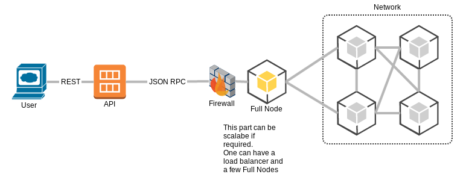

# JSON-RPC API

The full node includes an rpc server configured to listen on a specific port for JSON-RPC requests from your client application.

To get started, first ensure you have a full node running, connected to --devnet, and listening for rpc requests.  You can find this information on the node's command line terminal output:


The JSON-RPC API allows your client application to securely interact with your node, allowing you to do things like generate blocks, verify blocks and transactions, and publish transactions to the network.



### Authentication

All API requests are being served by your local rpc connection. The user credentials for your rpc connection were defined in the node command options:

```bash
$ ./btcd --devnet --rpclisten=localhost:18334 --rpcuser=user --rpcpass=pass --notls --acceptanceindex --txind
```

### JSON-RPC API Reference

For a list of available API requests and their format please see the [JSON-RPC API Refrence](../../../reference/kaspa-full-node/rpc-api/).


